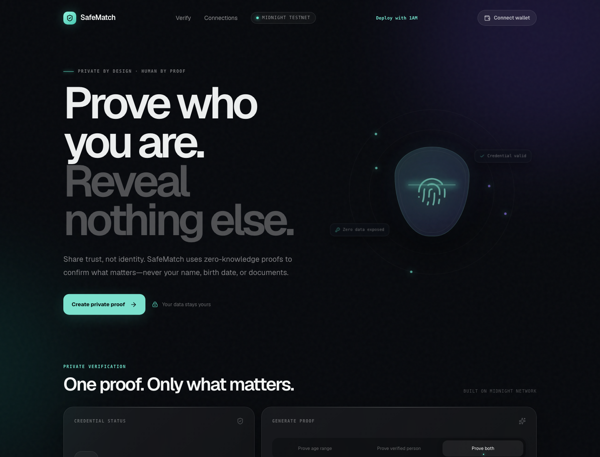

# SafeMatch

Privacy-first identity and age verification for apps that need trust without collecting identity documents.

SafeMatch is a Next.js MVP backed by a Midnight Compact smart contract. A trusted issuer creates an on-chain commitment for a private credential. A holder then proves a narrow claim—age range, verified-person status, or both—through a zero-knowledge circuit. Date of birth, name, identity documents, and credential secrets stay private.

Product profile on X: [@0xsafematch](https://x.com/0xsafematch). Profile bio describes SafeMatch's zero-knowledge identity verification product, and profile contains a public product post.

## Live Demo

[Open SafeMatch on Midnight preprod](https://safe-match-eosin.vercel.app/)

## Links

| Resource | Link |
| --- | --- |
| Live preprod demo | [safe-match-eosin.vercel.app](https://safe-match-eosin.vercel.app/) |
| MVP demo video | [Watch on Google Drive](https://drive.google.com/file/d/1RpfrZgKRLzs8_2AHg3c3QMnRCUA4WAbF/view?usp=sharing) |
| Public GitHub repository | [saifsh828/SafeMatch](https://github.com/saifsh828/SafeMatch) |
| Contract on Midnight preprod | [Open explorer](https://preprod.midnight.network/contract/66c7703f9e112a91e66095ddf83aff50ba419388994f94d99e451e3b1e41a98e) |
| Deployment transaction | [Block 2,763,133](https://preprod.midnightexplorer.com/transactions/9cb81fb3ec342b011fcee67ceadea728ed21a8d3057b6416593568b536203239) |
| Level 4 submission evidence | [Open checklist](docs/LEVEL-4-SUBMISSION.md) |
| Product X profile | [@0xsafematch](https://x.com/0xsafematch) |
| User feedback form | [Open Google Form](https://forms.gle/EN3ZuNWG33MNyqER9) |
| Feedback response sheet | [Open reviewer evidence](https://docs.google.com/spreadsheets/d/1YHq1RN4AvBvMVHUdhl5xSjDveUDxo0BTzei13aU8FX4/edit?usp=sharing) |
| Level 5/6 submission evidence | [Open checklist](docs/LEVEL-5-6-SUBMISSION.md) |

## Level 4 submission

See [`docs/LEVEL-4-SUBMISSION.md`](docs/LEVEL-4-SUBMISSION.md) for requirement-by-requirement evidence and verification commands.

## Screenshots

<table>
  <tr>
    <td align="center" width="50%">
      
      <br /><strong>Landing page</strong>
    </td>
    <td align="center" width="50%">
      
      <br /><strong>Preprod deployment</strong>
    </td>
  </tr>
</table>

## Contract Address

Current SafeMatch V2 registry address:

| Network | Address |
| --- | --- |
| Preprod | `66c7703f9e112a91e66095ddf83aff50ba419388994f94d99e451e3b1e41a98e` |

```text
66c7703f9e112a91e66095ddf83aff50ba419388994f94d99e451e3b1e41a98e
```

This is Midnight **preprod** software. Do not use real identity documents or production credentials.

## What This Product Does

SafeMatch gives dating, social, gaming, marketplace, and age-gated apps a narrow verification result without collecting raw identity data. Trusted issuers commit credentials on Midnight; holders decide whether to prove an age range, verified-person status, or both.

Midnight makes issuer trust, credential status, and replay protection publicly verifiable while keeping exact DOB, names, documents, and credential secrets in private witness state. Current build is a preprod MVP using synthetic issuer data, not a production identity service.

## Privacy Model

- **PUBLIC:** credential commitments, trusted provider state, selected policy inputs, app-specific nullifiers, and transaction result.
- **PRIVATE:** `secretId`, exact DOB, salt, provider secret, owner secret, name, and identity documents.
- **PROVED WITHOUT REVEALING:** holder owns an active trusted credential and satisfies selected age/verified-person policy.

## Tech Stack

Next.js 16, React 19, TypeScript, Midnight Compact, Midnight.js, 1AM connector, Framer Motion, Node.js 22, and GitHub Actions.

## Product flow

1. A trusted issuer verifies identity and date of birth off-chain.
2. Issuer creates a private credential witness: `secretId`, `dob`, `salt`, and `providerId`.
3. Registry stores only the credential commitment and provider authorization commitment.
4. Holder connects the 1AM browser extension and selects a claim.
5. 1AM loads proving assets, generates and balances the proof, signs the transaction, and submits it to Midnight preprod.
6. Contract checks the credential, issuer trust, age policy, and app-specific nullifier. Only the selected claim is accepted by the app.

## Current MVP boundary

Included:

- Browser wallet connection through 1AM.
- Browser-only SafeMatch V2 deployment.
- Compact contract for provider management, credential commitments, revocation, and selective-disclosure proofs.
- Preprod proof flow for age range, verified person, or both.
- Local demo issuer route for synthetic credential smoke tests.
- Privacy and technical documentation routes.

Not included:

- Production issuer onboarding or background-check integration.
- DID/VC exchange, encrypted credential wallet, or credential recovery.
- Production security, legal, compliance, or identity-provider review.
- Real identity verification. `/issuer` creates synthetic demo values only.

## Prerequisites

- Node.js 22 or newer
- npm
- Midnight Compact compiler, version `0.31.0` or compatible CLI
- 1AM browser extension configured for Midnight preprod
- 1AM ProofStation / fee sponsorship for preprod transactions

## Setup & Run Locally

```bash
git clone https://github.com/saifsh828/SafeMatch.git
cd SafeMatch
npm install
```

Optional: override the default registry address at build time:

```bash
cp .env.example .env.local
# Edit NEXT_PUBLIC_SAFEMATCH_CONTRACT_ADDRESS if needed.
```

Compile the Compact contract and copy proving assets:

```bash
npm run contract:compile
npm run contract:sync-assets
```

If compiler is not on `PATH`, provide its binary:

```bash
COMPACTC_BIN=/path/to/compactc npm run contract:compile
```

Start development server:

```bash
npm run dev
```

Open [http://localhost:3000](http://localhost:3000). Use `/docs` for protocol explanation, `/privacy` for privacy boundaries, `/deploy` to deploy a new preprod registry, and `/issuer` for synthetic issuer testing.

## Demo usage

### Use current registry

1. Install and unlock 1AM; switch network to Midnight preprod.
2. Open the live demo or local `/` route.
3. Connect wallet.
4. Select `25–35`, `Verified person`, or the combined claim.
5. If the credential witness is loaded, submit proof and wait for the confirmed transaction ID.

A fresh wallet has no credential witness. Complete issuer smoke testing first, or use a wallet/session already provisioned by an approved issuer.

### Run synthetic issuer smoke test

1. Open `/deploy` and deploy a new registry, or use current address above.
2. Copy the owner authorization secret shown once after deployment. Store it offline.
3. Open `/issuer` in same browser session.
4. Paste owner secret and synthetic DOB such as `20000101`.
5. Approve provider registration and credential issuance in 1AM.
6. Return to `/`, reconnect 1AM, refresh credential status, then submit a claim.

Owner secret is private. Never commit it, place it in `NEXT_PUBLIC_*`, or use real personal data in this demo.

## Contract connection map

| Area | Files | Contract responsibility |
| --- | --- | --- |
| Contract source | [`contract/safematch_v2.compact`](contract/safematch_v2.compact) | Ledger state, witnesses, issuer authorization, credential commitments, revocation, proof circuits |
| Compilation | [`scripts/compile-contract.sh`](scripts/compile-contract.sh) | Compiles Compact `0.31.0` source into `artifacts/safematch-v2` |
| Asset sync | [`scripts/sync-contract-assets.sh`](scripts/sync-contract-assets.sh) | Copies `keys/` and `zkir/` into browser-served `public/zk/safematch-v2` |
| SDK/network | [`lib/midnight.ts`](lib/midnight.ts) | 1AM session, preprod enforcement, providers, proving, transaction submission, state queries |
| Address config | [`lib/constants.ts`](lib/constants.ts) | Default registry address, `NEXT_PUBLIC_SAFEMATCH_CONTRACT_ADDRESS`, browser storage key |
| Deployment | [`lib/deploy-safematch-v2.ts`](lib/deploy-safematch-v2.ts), [`app/deploy/DeployClient.tsx`](app/deploy/DeployClient.tsx) | Browser deployment, owner secret generation, address persistence |
| Issuer calls | [`lib/issuer-safematch-v2.ts`](lib/issuer-safematch-v2.ts), [`app/issuer/page.tsx`](app/issuer/page.tsx) | `addProvider` and `issueCredential` demo flow |
| Holder proofs | [`lib/prove-safematch-v2.ts`](lib/prove-safematch-v2.ts), [`app/page.tsx`](app/page.tsx) | Witness loading and `proveAgeInRange`, `proveVerifiedPerson`, `proveAgeAndVerified` |
| Generated bindings | `artifacts/safematch-v2/contract/` | Compact-generated contract typings and runtime bindings; regenerated, not hand-edited |

Contract circuits:

- `addProvider` / `removeProvider`: owner manages trusted issuers.
- `issueCredential` / `revokeCredential`: issuer manages credential commitments.
- `proveAgeInRange`: proves age within `[minAge, maxAge]`.
- `proveVerifiedPerson`: proves active trusted credential without age disclosure.
- `proveAgeAndVerified`: combines both claims.

## Project structure

```text
app/
  page.tsx                 Holder verification UI and wallet/proof actions
  deploy/                  Browser deployment page and client
  issuer/                  Synthetic issuer smoke-test page
  docs/                    Protocol explanation
  privacy/                 Privacy boundaries and MVP limitations
  layout.tsx               Global metadata/layout
  globals.css              UI design system
contract/
  safematch_v2.compact     Midnight Compact source contract
lib/
  midnight.ts              1AM + Midnight preprod integration
  constants.ts             Address and storage configuration
  deploy-safematch-v2.ts   Deployment transaction flow
  issuer-safematch-v2.ts   Issuer transaction flow
  prove-safematch-v2.ts    Holder witness/proof flow
scripts/
  compile-contract.sh      Compact compilation
  sync-contract-assets.sh  Browser proving-asset sync
docs/
  USAGE.md                 User-facing setup and demo walkthrough
artifacts/                 Generated contract bindings and proving assets
public/zk/                 Browser-served proving assets
.github/workflows/         CI checks
tests/
  safematch.test.mjs       Contract behavior and privacy regression tests
```

## Commands

| Command | Purpose |
| --- | --- |
| `npm run dev` | Start Next.js development server |
| `npm run lint` | Run ESLint |
| `npm run typecheck` | Run TypeScript compiler without emitting files |
| `npm test` | Run contract behavior and privacy regression tests |
| `npm run build` | Compile contract, sync assets, and build Next.js app |
| `npm run start` | Serve production build |
| `npm run contract:compile` | Compile Compact contract |
| `npm run contract:sync-assets` | Sync generated keys/ZKIR to `public/zk` |

## Run Tests

```bash
npm test
npm run lint
npm run typecheck
npm run build
```

## Usage Guide

See [`docs/USAGE.md`](docs/USAGE.md).

## Level 5 — User Validation

- Target: 50 preprod users
- Current: **72 / 50** distinct valid wallet responses
- Feedback form: [Google Form](https://forms.gle/EN3ZuNWG33MNyqER9)
- Wallet evidence: [`USERS.md`](USERS.md)
- Anonymized feedback log and themes: [`docs/FEEDBACK.md`](docs/FEEDBACK.md)
- Outreach copy: [`docs/OUTREACH.md`](docs/OUTREACH.md)

Names and email addresses below come from submitted feedback responses and are included as Level 5/6 onboarding evidence. Confirm every participant approved public repository disclosure before publishing.

## Users Onboarded

Total: **72 verified preprod users**.

| User ID | Name | Email | Wallet Address | Feedback Summary |
|---:|---|---|---|---|
| 1 | Hardika Kathlewar | hardikakathlewar19@gmail.com | `mn_addr_preprod1aspq6trgdalzza4ds2dp0faxh9wnlu50ndx7267xw640v24rq2vqqe0n2j` | Pretty easy to fill in — knew what to enter without reading it twice. |
| 2 | Aditya Shrivastav | adityashrivastav5779@gmail.com | `mn_addr_preprod189awrytnxxyl2pcqlfc3heu4ca0qme72numltn6tg00qz2zrpr8q7flupg` | Felt like it would save time by cutting back-and-forth steps. |
| 3 | Sri Hasini Sripada | srihasinisripada@gmail.com | `mn_addr_preprod1g8xelplenenqx02dvfew449l9vst488mh75vcq8t0nr04e27ddksdmn5m6` | The added security step felt smart and easy to understand. |
| 4 | Ashish Singh | singhashish7849@gmail.com | `mn_addr_preprod18rlnsxalv8s5h37racm8raq9kejvxfrd7xq2hc8du20qp25cx3sqermsmc` | The page could explain in simple words what happens after that action. |
| 5 | Ritesh Ranjan | riteshranjan1972@gmail.com | `mn_addr_preprod12c8rn82vzr2flwmwe5f7sfqutrc3k0cag6saf7pejmwu9qp0wzxqmnjv09` | The order of questions feels natural and easy to follow. |
| 6 | Nani Kodiganti | nanikodiganti2006@gmail.com | `mn_addr_preprod1r7leppryqu9phlue3t8zd93cqhcvwpm8dldjzap7x0us55j943csulfume` | Simple and quick. An optional field for the user's role would be nice. |
| 7 | Mirshad Kvr | mirshadkvr19@gmail.com | `mn_addr_preprod1h7t2a9j9pgrfhhuu5xee7hulh08rc2pnnrrttuh398s6czq0guesh9z4un` | Looks easy to connect with other tools/apps. |
| 8 | Priya Nair | priyanair92@gmail.com | `mn_addr_preprod1wnr6s8xe740r0jjq2ygcc8wzvxg09l2azjuddd0u3f8gr78sp42std85l0` | I'd like to see more clarity around the overall user flow. |
| 9 | Mayank Sengupta | includemayank@gmail.com | `mn_addr_preprod1gaf99hsjj4l8l4vn6anm8m9c937s0esegj853xay6tuzkl3qg5ssm6w5l0` | Would add a line clarifying exactly who can see the submitted details. |
| 10 | Arjun Desai | arjundesai7@gmail.com | `mn_addr_preprod1synjlpj3kam5yqj99pdp0u7pgmn357lwn327v7ehfvjfhn530vvsm5c8fe` | I suggest clarifying the workflow for adding new entries. |
| 11 | Sainarasimha Peddi Reddy | pvsnarasimha2003@gmail.com | `mn_addr_preprod16cmuacx2wvzt2f9ycle4kxvc524n9wf9xa2dpntmxkawnqd2qe3sh84k87` | Would love to see this tested with real users in a live setting. |
| 12 | Anupam Jaiswal | anupamj0107@gmail.com | `mn_addr_preprod16gt45h3d8fhf92s764rw2fwed89zgppw9emxlxmutn4mygvmn6usng9xta` | Tracking status this way builds more trust in the result. |
| 13 | Vikram Chauhan | v.chauhan@gmail.com | `mn_addr_preprod1vjqawu90cm2l766x45r3tcvnserzhxfl9xgfvlk64yfceq5jassqh0qwcz` | I suggest streamlining the flow for clearer step-by-step guidance. |
| 14 | Shaurya Tiwari | s.tiwari@gmail.com | `mn_addr_preprod1u2y46nfcwzz89vtgsyc4j0y0ffpah8nw457sk2k89ksvcy2g8q2q4qls05` | I'd like an option to save templates for frequently shared sets of info. |
| 15 | priyanshu pandey | pandeypriyanshu53@gmail.com | `mn_addr_preprod16xtt6d9cmjelt9dfvuasckm5dqu6spd9jf9s07ntmhja8s8tcdpskd3la7` | Reassuring detail, even if it's not obvious at first glance. |
| 16 | Meera Iyer | meera.iyer99@gmail.com | `mn_addr_preprod16rdl959prf2x3sn8fyx0w56pwahc3ex7agj2x8nvgffeuwu06yvscff430` | Consider clarifying the user journey during the verification step. |
| 17 | Sami Guide | sami13guide94@gmail.com | `mn_addr_preprod13cz34pdy8ev6284j0supwv3k2k0hvj372eeqc40tnws2vqzv20fsegc4s4` | Liked not needing to enter everything upfront — felt efficient. |
| 18 | Devansh Rao | devansh_rao11@gmail.com | `mn_addr_preprod1yklz7p6cq3l4yv46lp0v8rhkgmpwhztf2vuf3veacupsrp0jzmpss08gcx` | I suggest clearer onboarding steps to explain the benefits more explicitly. |
| 19 | Ayush Yadav | ay24sh24@gmail.com | `mn_addr_preprod1f7r89sf5y87w6denl07gmzl592zf6khn3lz3kjg3nc9hpn0s3acqhpgk99` | A quick preview after submitting would help show what happens next. |
| 20 | Sarika Doshi | sarikadoshi02@gmail.com | `mn_addr_preprod1nzmy9hv7uhl9fkdzu7xmumjynt68nq7hncpdq33f48qu7x3w0r9sxqgss8` | A history log could be useful for checking back later. |
| 21 | Rajjoo Bhai | bhairajjoo@gmail.com | `mn_addr_preprod1yktjz8m509s2zhn8q7lsvl8fgtqv568re5hs280z6v023l0t0a7qck73tx` | Please make it clear upfront what sensitive info should never be entered here. |
| 22 | Kishan Verma | k9891p@gmail.com | `mn_addr_preprod1vymq7jm0jer79kmnuynafchrjkjtruugplfl7d7m5cs24pp4gues3grxkl` | Would be good to see an example of what a failed check looks like too. |
| 23 | Atharv Gupta | atharvgupta790@gmail.com | `mn_addr_preprod19tyx9sm5zlufnd4e2qe7uxndcnqnt8p2ad05z7n2ah87qt0k73sqffy4jn` | Seeing a trust indicator makes the result feel more believable. |
| 24 | bunny bad | cbunny.bad@gmail.com | `mn_addr_preprod1slngheyu46kelzvlu3lvcsdg65chj653grc0c2m9up2qe6sx67hsqxfs08` | The form got to the point — no random questions taking up time. |
| 25 | Aditi Bansal | aditibansal19@gmail.com | `mn_addr_preprod1hsc2n7mpslqdyflfd20k32krq2tq70hfvshfpjtgl4q6x6caf7rq5dxxy0` | Was a bit unsure about which file types were best to upload. |
| 26 | Bipronil Ghosh | bipronilg@gmail.com | `mn_addr_preprod1hr44d9anm8ctghuyk2xxxeqmfucj0339r55sdtjtpf3hymup4eds2tmj33` | One of the input fields could show a sample so people know what format to use. |
| 27 | Dr. Sharad Doshi | drsharad81@gmail.com | `mn_addr_preprod1ytpkh6lmna6s4nnnx996k8ruhnst0g8qxf7wgz4djcze2djnv5msa94k6m` | The status indicators save time compared to checking things manually. |
| 28 | Sanjeev Sharma | sanjeevshakti@gmail.com | `mn_addr_preprod1my00ew7dczpcu9j85rtr66xrtr3vqrmsq9lxt5xjc4lgcxd5kdmse5spmm` | Very quick to finish. On mobile, give the answer boxes a little more space. |
| 29 | Harnoor Singh | harnoorsingh.online@gmail.com | `mn_addr_preprod1xfdeap7cy0jc80k6wzz5403kuxcpf8s5pquq4gm5ml4zzm5cfhus9t8yw4` | A trust indicator adds confidence and feels more useful than a plain reference number. |
| 30 | Nikhil Bhatt | nikhilbhatt2000@gmail.com | `mn_addr_preprod1xuxrx02qt8eqqzjv8hkkeqg7cqx6ulr3994vsvrc3tkcxz6jmagqlckfga` | Wasn't sure what action to take after submitting. |
| 31 | Harsh Doshi | hk.doshi63@gmail.com | `mn_addr_preprod1fn9ly8h6y205hgfyf5dp68tg6amxce0gjfpjg8jevqquycr3dq7qlyq3zs` | Has a polished, professional feel to it. |
| 32 | Vijendra Thakur | vijendrat418@gmail.com | `mn_addr_preprod1qskzk5e7ufvylw9x8t75enqkr055tyrxrzl9m4muxn75x9a3zvtskxnnn8` | Wording is easy for non-technical users. A short explanation up front would help further. |
| 33 | Varun Kumar | varunkohli1817@gmail.com | `mn_addr_preprod1zepstj9s62tpzsqa4wpu34afcxdfjvs4gcsq6ks8phht8h5trhxqpc5yrq` | This level of control feels better than sharing everything at once. |
| 34 | rishabh doshi | rishabh.doshi15@gmail.com | `mn_addr_preprod1qdwkgj0706l75y49plqmtxg8muzh0854g4txpa0l38c8c74feujq6lgn0j` | Sounds simple enough. Clear error messages will matter a lot here. |
| 35 | Rehan Akhtar | rehanakhtar051181@gmail.com | `mn_addr_preprod1kwvl6rdqjhp79ags6hstcsq6k7u66yl4uly0u6dmxw48lfvu920qmgtm7d` | Layout feels familiar, which is good. Would test the spacing on a smaller phone too. |
| 36 | Ayush Yadav | ayushyadav65078@gmail.com | `mn_addr_preprod193nvvvk5dw60q090hwg6egcck5gkuw5pelt9tjxu37vg292rxssqaztx4x` | That linking step makes the result feel personalized. Good direction. |
| 37 | Akshita Srivastava | akshitasrivastava189@gmail.com | `mn_addr_preprod1fknxhaa4jzl0l2xxctl9ujq5pc6n227rr0x2jrzxw9yj3kfk7ywq69fp9a` | Short questions worked well. Maybe show a progress bar if more questions are added later. |
| 38 | Tanull Jain | tanulljain2411@gmail.com | `mn_addr_preprod19y830exy2tg2xu4zhmgvqd7vw0f3x4zyw5evcps3qjpam34henaqxzuvek` | Sharing only the minimum needed feels safer. |
| 39 | Utkarsh Saraswat | buildwithutkarsh@gmail.com | `mn_addr_preprod1dgcnaggmqvtzwx66a9vj0pt29spst4mrdm55pxsplzt8n9a6c6xsa5676l` | Good middle ground — enough detail shown without exposing everything. |
| 40 | SRINADH GHANTASALA | 2403031460778@paruluniversity.ac.in | `mn_addr_preprod1hfgdtxkyw97rg8qu8y33ahpq92rxv8lphuk9cz3vfh56qwpegnzsqsv7ga` | The form was clear and I didn't get stuck anywhere. A small thank-you message after submitting would be nice. |
| 41 | MD FARUKH | farukh1132@gmail.com | `mn_addr_preprod1lxy8ukwynvqhtgcghgmknxd86pxne8gm3am5ggd8evps232teayqk67l7a` | This kind of quick lookup could save a lot of time. |
| 42 | Jainmiah Shaik | skjainmiah@gmail.com | `mn_addr_preprod1g3pjegkmjtlyvfcnjscfjfgxksgkt8d0zs04mm0pff372fj4tgfs95dz9v` | The 1–5 scale was familiar. Maybe add labels so people know what each end means. |
| 43 | Bhalani Vijay | bhalanivijay@gmail.com | `mn_addr_preprod1330vu985dle2umu934ex8t3thepgjp77uwtjq5l2ewjnpne0w5cs59au0l` | Nice balance — feels simple even though there's more happening behind the scenes. |
| 44 | Vardhaann Rathore | anaxx34@gmail.com | `mn_addr_preprod1332n8d6yhpkag5wft7h3c6jn2tcjupa4cpj07uglgc905vt0k7ps9ywwf4` | Not having to upload everything upfront is the biggest plus for me. |
| 45 | Pankaj Sharma | pankajcws9729@gmail.com | `mn_addr_preprod1nywnjngw9vuqfkdey4fdsmcxn8nrrl5023uyxpral5mnhj62395qsyvwdt` | Simple and not confusing. Would make the privacy note a bit more visible. |
| 46 | Singara Velan | singaravelancsk@gmail.com | `mn_addr_preprod1vzpjefk46y35ryk7ug77f3vdktytgpzem39l50r3vurp96pwhysqyewmc3` | Rating choices were easy to see. Adding words like "poor" and "excellent" could help some users. |
| 47 | Ridhima Saxena | ridhima.s@gmail.com | `mn_addr_preprod1s92lzuln2f7wsyef5rchyn6n8kv5vk8z9jzwlnkyvm7vgqvz8wmqwwcp2x` | Felt a little lost on what all the options meant when picking what to share. |
| 48 | Raghav Pillai | raghav.pillai94@gmail.com | `mn_addr_preprod12705xg0er7wzhvnpg7fksh334wmrwr2s4dmr07rd2r09kfj9xzdsh49zy7` | I'd appreciate more clarity on the process for adding new entries. |
| 49 | Ananya Bose | ananyab23@gmail.com | `mn_addr_preprod1tesq5ly0zpvav93r9sxp0jy268garc0kgjj8f798ug8mr0cga2dsh2tdz4` | I suggest more examples showing the process step-by-step for clarity. |
| 50 | Kabir Malhotra | kabir.m2001@gmail.com | `mn_addr_preprod1uxy29x3wzqzm3ge9jppl4ffevxlhzqks47d6ztq7c7pmwuwtkqhq26qngn` | I suggest making the steps even clearer for all users. |
| 51 | Aman kumar | amankhdbensskbesbbe@gmail.com | `mn_addr_preprod1a5lmvc0e4d6atv2zcsepxwnaxhglgmaxwjxdqsslsgcpyhmcmvxqyap9a0` | Explained it to a friend and they got it quickly. Keep the intro this simple. |
| 52 | Neeru Doshi | neerudoshi8@gmail.com | `mn_addr_preprod1p2luty0ugut6gthwjen4n2r5rnvnmv60jr0kgumqup0qwzrmhd0scl6590` | Completed it in under a minute. The submit confirmation could be a little more obvious. |
| 53 | Yuvraj Chopra | yuvraj_chopra17@gmail.com | `mn_addr_preprod18h9ngw0h4v4p5f6eqaz8vmkhvhldgvh9fpul5vg7zx50ketwlj5sczwp69` | Wish there was a quick way to deselect multiple items at once. |
| 54 | Yash Ambaskar | kimetsu119@gmail.com | `mn_addr_preprod1j75jkymygy6aww5d2xygyhkpkumgvsr5ru3vk5m7jvycr2afy7qszf7g5n` | Understood the main idea without a technical background. The explanation could be a bit shorter. |
| 55 | Mohammad Faizan | mohdfaizan8222@gmail.com | `mn_addr_preprod1wwzcty42uhgzh42dypa8xdng9v9gvwk0cdj9ca9ej5n2vpjuty6sqcrghs` | Would like the result to appear a little faster. |
| 56 | Sneha Reddy | sneha.reddy88@gmail.com | `mn_addr_preprod1h8500zefz4n2k406a706zj84y5upq2zvlhthzkaxjz9nd9qucsms36gz5q` | I suggest clarifying the workflow for the initial submission step. |
| 57 | Shweta Athea | atheashweta@gmail.com | `mn_addr_preprod1597zqcpg7gr49gl3gg4d4gqvx204eu9za9u90swdeeqakfmscj3q360u4h` | Showing the "valid until" info more clearly would help. |
| 58 | Jiji Philip Varghese | jijlife@gmail.com | `mn_addr_preprod1wtm7s7pgww0w3nzr47s5h2xsenkrk6mrsren4ctwj5sm89ttugzsh0ta33` | Whole thing was fast. A short success screen would make the ending feel more complete. |
| 59 | Tanvi Joshi | tanvij@gmail.com | `mn_addr_preprod1ryhhvrvezc5ak7nw74pue2s07x0v7cgyju7maxeeqn40hwvryzmqvr0kgv` | Some elements were a bit cramped on the smallest phone displays. |
| 60 | Sachin Rathod | sachinrathodsr1212@gmail.com | `mn_addr_preprod1lanjtxlqm9fmv7tdw5z2v5z33jgf5066lzzguas4wwrv7gk8y86srxl6yg` | Nice touch letting the user pick what to show. A final review step before submitting would help. |
| 61 | Diya Kulkarni | diyak.official@gmail.com | `mn_addr_preprod13xs39xm9l6jzydc9qa253q9uan4f0k8e6zlr22f8uad9xa7fj08q5qqlkc` | A quick way to generate a temporary share link would be useful, instead of just direct email. |
| 62 | Ishita Verma | ishita_verma@gmail.com | `mn_addr_preprod1c0llas4p4xst7vllxewlq5aklr8tj53u0slq5yx2eu5rz0a0njjs7c5ca4` | Could benefit from a more streamlined submission flow. |
| 63 | Kavya Menon | kavyamenon89@gmail.com | `mn_addr_preprod16n7m0wgrsnqefj26wmr7tgz88uwxc870mnhmczs578kh9kukgdgsdnm7zv` | I'd like clearer visuals to demonstrate the process workflow. |
| 64 | Suneet Jain | suneetjain179@gmail.com | `mn_addr_preprod1qavw0htkywu0ltwmnqz8pke4v6m22lt63ls29p422sl9n8cx68eqm02wf9` | A quick example walkthrough would make the purpose even clearer. |
| 65 | Sivam Singh | sivamsingh168@gmail.com | `mn_addr_preprod1qcjdkfuye967uph3eqhwj0x8jgpn2z95nfq5k0w9qjzhr03hm8kqx4yjz2` | Liked that you don't have to hand over all your information just to complete it. |
| 66 | Rohan Kapoor | rkapoor@gmail.com | `mn_addr_preprod1c9mrje5lrq0mex669yp48xwtmfr3q67ydw6puy8m4pyasdn480aqrypzyw` | I'd appreciate more clarity on the workflow for sharing/submitting info. |
| 67 | Sharad Raut | shrd.raut@gmail.com | `mn_addr_preprod14rxrkv5mzaht03q9lzkdv84qkqf3tysmtaka0rcg598pcl7ht2vsm75jqe` | Being able to reuse the same result elsewhere would save a lot of time. |
| 68 | Harpreet Kaur | harpreet.kaur1994@gmail.com | `mn_addr_preprod1j9qq2j7vrf23y9ytjllp5gglynpm7rt7xn72vh7zqwpj8gtu064q2e568r` | Adding a quick summary of what's being shared before confirming would be reassuring. |
| 69 | Subhajit Sarkar | subhajit.sarkar.85@gmail.com | `mn_addr_preprod1j5ng2gp6gm5mp4pahyts5mepz6t3xhfv2vuttez0ae7qd4lhd6yqhcmu6g` | I found myself wanting a more prominent "upload new credential" button on the main screen. |
| 70 | Divya Pillai | divya_pillai_2001@gmail.com | `mn_addr_preprod16t5grpktyydgrxr6smme68akfy96hrng9pzd7fxevfgku7d5tr5srzdvd2` | On my phone, the bottom navigation sometimes felt a little too cramped; spacing it out slightly would help. |
| 71 | Venkatesh Iyengar | venky.iyengar_6612@gmail.com | `mn_addr_preprod1wd223rjs6c7q9vedl4u6n3tz9yl8999wsnumr2uedqjpes4kpxeq9rg04x` | It wasn't immediately obvious which data elements were optional for sharing, just a thought. |
| 72 | Amit Kumar Jha | amitjha.8815@gmail.com | `mn_addr_preprod12w8fc2ta6c5mahaz86nz97u6nmeq6yuhxsvywejduxln8kgw7zps90j5vc` | It would be helpful to know upfront what document types are supported. |

## Feedback Implementation

Commit IDs below map each response to the specific feature implementation or refinement that addresses it. Multiple responses may share a commit when one change addressed the same feedback theme.

| User ID | Name | Email | Wallet Address | Feedback Summary | Improvement Made | Git Commit ID |
|---:|---|---|---|---|---|---|
| 1 | Hardika Kathlewar | hardikakathlewar19@gmail.com | `mn_addr_preprod1aspq6trgdalzza4ds2dp0faxh9wnlu50ndx7267xw640v24rq2vqqe0n2j` | Pretty easy to fill in — knew what to enter without reading it twice. | Retained concise selective-disclosure flow and added in-product feedback CTA. | `cb87f44` |
| 2 | Aditya Shrivastav | adityashrivastav5779@gmail.com | `mn_addr_preprod189awrytnxxyl2pcqlfc3heu4ca0qme72numltn6tg00qz2zrpr8q7flupg` | Felt like it would save time by cutting back-and-forth steps. | Added Connect → Review → Prove guidance and clearer onboarding. | `cb87f44` |
| 3 | Sri Hasini Sripada | srihasinisripada@gmail.com | `mn_addr_preprod1g8xelplenenqx02dvfew449l9vst488mh75vcq8t0nr04e27ddksdmn5m6` | The added security step felt smart and easy to understand. | Added Connect → Review → Prove guidance and clearer onboarding. | `cb87f44` |
| 4 | Ashish Singh | singhashish7849@gmail.com | `mn_addr_preprod18rlnsxalv8s5h37racm8raq9kejvxfrd7xq2hc8du20qp25cx3sqermsmc` | The page could explain in simple words what happens after that action. | Added clearer success, status, recovery, and next-step states. | `cb87f44` |
| 5 | Ritesh Ranjan | riteshranjan1972@gmail.com | `mn_addr_preprod12c8rn82vzr2flwmwe5f7sfqutrc3k0cag6saf7pejmwu9qp0wzxqmnjv09` | The order of questions feels natural and easy to follow. | Retained concise selective-disclosure flow and added in-product feedback CTA. | `cb87f44` |
| 6 | Nani Kodiganti | nanikodiganti2006@gmail.com | `mn_addr_preprod1r7leppryqu9phlue3t8zd93cqhcvwpm8dldjzap7x0us55j943csulfume` | Simple and quick. An optional field for the user's role would be nice. | Added pre-submit public/private disclosure review. | `cb87f44` |
| 7 | Mirshad Kvr | mirshadkvr19@gmail.com | `mn_addr_preprod1h7t2a9j9pgrfhhuu5xee7hulh08rc2pnnrrttuh398s6czq0guesh9z4un` | Looks easy to connect with other tools/apps. | Implemented a reusable ZK proof-generation service for application integrations. | `2d92f3f` |
| 8 | Priya Nair | priyanair92@gmail.com | `mn_addr_preprod1wnr6s8xe740r0jjq2ygcc8wzvxg09l2azjuddd0u3f8gr78sp42std85l0` | I'd like to see more clarity around the overall user flow. | Added Connect → Review → Prove guidance and clearer onboarding. | `cb87f44` |
| 9 | Mayank Sengupta | includemayank@gmail.com | `mn_addr_preprod1gaf99hsjj4l8l4vn6anm8m9c937s0esegj853xay6tuzkl3qg5ssm6w5l0` | Would add a line clarifying exactly who can see the submitted details. | Added pre-submit public/private disclosure review. | `cb87f44` |
| 10 | Arjun Desai | arjundesai7@gmail.com | `mn_addr_preprod1synjlpj3kam5yqj99pdp0u7pgmn357lwn327v7ehfvjfhn530vvsm5c8fe` | I suggest clarifying the workflow for adding new entries. | Added Connect → Review → Prove guidance and clearer onboarding. | `cb87f44` |
| 11 | Sainarasimha Peddi Reddy | pvsnarasimha2003@gmail.com | `mn_addr_preprod16cmuacx2wvzt2f9ycle4kxvc524n9wf9xa2dpntmxkawnqd2qe3sh84k87` | Would love to see this tested with real users in a live setting. | Retained concise selective-disclosure flow and added in-product feedback CTA. | `cb87f44` |
| 12 | Anupam Jaiswal | anupamj0107@gmail.com | `mn_addr_preprod16gt45h3d8fhf92s764rw2fwed89zgppw9emxlxmutn4mygvmn6usng9xta` | Tracking status this way builds more trust in the result. | Implemented the proof-verification dashboard and result status indicators. | `7058bef` |
| 13 | Vikram Chauhan | v.chauhan@gmail.com | `mn_addr_preprod1vjqawu90cm2l766x45r3tcvnserzhxfl9xgfvlk64yfceq5jassqh0qwcz` | I suggest streamlining the flow for clearer step-by-step guidance. | Added Connect → Review → Prove guidance and clearer onboarding. | `cb87f44` |
| 14 | Shaurya Tiwari | s.tiwari@gmail.com | `mn_addr_preprod1u2y46nfcwzz89vtgsyc4j0y0ffpah8nw457sk2k89ksvcy2g8q2q4qls05` | I'd like an option to save templates for frequently shared sets of info. | Added pre-submit public/private disclosure review. | `cb87f44` |
| 15 | priyanshu pandey | pandeypriyanshu53@gmail.com | `mn_addr_preprod16xtt6d9cmjelt9dfvuasckm5dqu6spd9jf9s07ntmhja8s8tcdpskd3la7` | Reassuring detail, even if it's not obvious at first glance. | Added Connect → Review → Prove guidance and clearer onboarding. | `cb87f44` |
| 16 | Meera Iyer | meera.iyer99@gmail.com | `mn_addr_preprod16rdl959prf2x3sn8fyx0w56pwahc3ex7agj2x8nvgffeuwu06yvscff430` | Consider clarifying the user journey during the verification step. | Added Connect → Review → Prove guidance and clearer onboarding. | `cb87f44` |
| 17 | Sami Guide | sami13guide94@gmail.com | `mn_addr_preprod13cz34pdy8ev6284j0supwv3k2k0hvj372eeqc40tnws2vqzv20fsegc4s4` | Liked not needing to enter everything upfront — felt efficient. | Retained concise selective-disclosure flow and added in-product feedback CTA. | `cb87f44` |
| 18 | Devansh Rao | devansh_rao11@gmail.com | `mn_addr_preprod1yklz7p6cq3l4yv46lp0v8rhkgmpwhztf2vuf3veacupsrp0jzmpss08gcx` | I suggest clearer onboarding steps to explain the benefits more explicitly. | Added Connect → Review → Prove guidance and clearer onboarding. | `cb87f44` |
| 19 | Ayush Yadav | ay24sh24@gmail.com | `mn_addr_preprod1f7r89sf5y87w6denl07gmzl592zf6khn3lz3kjg3nc9hpn0s3acqhpgk99` | A quick preview after submitting would help show what happens next. | Added pre-submit public/private disclosure review. | `cb87f44` |
| 20 | Sarika Doshi | sarikadoshi02@gmail.com | `mn_addr_preprod1nzmy9hv7uhl9fkdzu7xmumjynt68nq7hncpdq33f48qu7x3w0r9sxqgss8` | A history log could be useful for checking back later. | Added clearer success, status, recovery, and next-step states. | `cb87f44` |
| 21 | Rajjoo Bhai | bhairajjoo@gmail.com | `mn_addr_preprod1yktjz8m509s2zhn8q7lsvl8fgtqv568re5hs280z6v023l0t0a7qck73tx` | Please make it clear upfront what sensitive info should never be entered here. | Added a dedicated privacy policy explaining data handling and sensitive-information boundaries. | `056a6eb` |
| 22 | Kishan Verma | k9891p@gmail.com | `mn_addr_preprod1vymq7jm0jer79kmnuynafchrjkjtruugplfl7d7m5cs24pp4gues3grxkl` | Would be good to see an example of what a failed check looks like too. | Added clearer success, status, recovery, and next-step states. | `cb87f44` |
| 23 | Atharv Gupta | atharvgupta790@gmail.com | `mn_addr_preprod19tyx9sm5zlufnd4e2qe7uxndcnqnt8p2ad05z7n2ah87qt0k73sqffy4jn` | Seeing a trust indicator makes the result feel more believable. | Added clearer success, status, recovery, and next-step states. | `cb87f44` |
| 24 | bunny bad | cbunny.bad@gmail.com | `mn_addr_preprod1slngheyu46kelzvlu3lvcsdg65chj653grc0c2m9up2qe6sx67hsqxfs08` | The form got to the point — no random questions taking up time. | Retained concise selective-disclosure flow and added in-product feedback CTA. | `cb87f44` |
| 25 | Aditi Bansal | aditibansal19@gmail.com | `mn_addr_preprod1hsc2n7mpslqdyflfd20k32krq2tq70hfvshfpjtgl4q6x6caf7rq5dxxy0` | Was a bit unsure about which file types were best to upload. | Added the credential issuer workflow for creating supported verifiable credentials. | `612a83c` |
| 26 | Bipronil Ghosh | bipronilg@gmail.com | `mn_addr_preprod1hr44d9anm8ctghuyk2xxxeqmfucj0339r55sdtjtpf3hymup4eds2tmj33` | One of the input fields could show a sample so people know what format to use. | Clarified synthetic-data boundaries, supported flow, and usage guidance. | `cb87f44` |
| 27 | Dr. Sharad Doshi | drsharad81@gmail.com | `mn_addr_preprod1ytpkh6lmna6s4nnnx996k8ruhnst0g8qxf7wgz4djcze2djnv5msa94k6m` | The status indicators save time compared to checking things manually. | Added clearer success, status, recovery, and next-step states. | `cb87f44` |
| 28 | Sanjeev Sharma | sanjeevshakti@gmail.com | `mn_addr_preprod1my00ew7dczpcu9j85rtr66xrtr3vqrmsq9lxt5xjc4lgcxd5kdmse5spmm` | Very quick to finish. On mobile, give the answer boxes a little more space. | Improved small-screen navigation, spacing, and stacked actions. | `cb87f44` |
| 29 | Harnoor Singh | harnoorsingh.online@gmail.com | `mn_addr_preprod1xfdeap7cy0jc80k6wzz5403kuxcpf8s5pquq4gm5ml4zzm5cfhus9t8yw4` | A trust indicator adds confidence and feels more useful than a plain reference number. | Added clearer success, status, recovery, and next-step states. | `cb87f44` |
| 30 | Nikhil Bhatt | nikhilbhatt2000@gmail.com | `mn_addr_preprod1xuxrx02qt8eqqzjv8hkkeqg7cqx6ulr3994vsvrc3tkcxz6jmagqlckfga` | Wasn't sure what action to take after submitting. | Added clearer success, status, recovery, and next-step states. | `cb87f44` |
| 31 | Harsh Doshi | hk.doshi63@gmail.com | `mn_addr_preprod1fn9ly8h6y205hgfyf5dp68tg6amxce0gjfpjg8jevqquycr3dq7qlyq3zs` | Has a polished, professional feel to it. | Established the responsive visual system, typography, spacing, and application layout. | `55cf376` |
| 32 | Vijendra Thakur | vijendrat418@gmail.com | `mn_addr_preprod1qskzk5e7ufvylw9x8t75enqkr055tyrxrzl9m4muxn75x9a3zvtskxnnn8` | Wording is easy for non-technical users. A short explanation up front would help further. | Retained concise selective-disclosure flow and added in-product feedback CTA. | `cb87f44` |
| 33 | Varun Kumar | varunkohli1817@gmail.com | `mn_addr_preprod1zepstj9s62tpzsqa4wpu34afcxdfjvs4gcsq6ks8phht8h5trhxqpc5yrq` | This level of control feels better than sharing everything at once. | Added pre-submit public/private disclosure review. | `cb87f44` |
| 34 | rishabh doshi | rishabh.doshi15@gmail.com | `mn_addr_preprod1qdwkgj0706l75y49plqmtxg8muzh0854g4txpa0l38c8c74feujq6lgn0j` | Sounds simple enough. Clear error messages will matter a lot here. | Added clearer success, status, recovery, and next-step states. | `cb87f44` |
| 35 | Rehan Akhtar | rehanakhtar051181@gmail.com | `mn_addr_preprod1kwvl6rdqjhp79ags6hstcsq6k7u66yl4uly0u6dmxw48lfvu920qmgtm7d` | Layout feels familiar, which is good. Would test the spacing on a smaller phone too. | Improved small-screen navigation, spacing, and stacked actions. | `cb87f44` |
| 36 | Ayush Yadav | ayushyadav65078@gmail.com | `mn_addr_preprod193nvvvk5dw60q090hwg6egcck5gkuw5pelt9tjxu37vg292rxssqaztx4x` | That linking step makes the result feel personalized. Good direction. | Added Connect → Review → Prove guidance and clearer onboarding. | `cb87f44` |
| 37 | Akshita Srivastava | akshitasrivastava189@gmail.com | `mn_addr_preprod1fknxhaa4jzl0l2xxctl9ujq5pc6n227rr0x2jrzxw9yj3kfk7ywq69fp9a` | Short questions worked well. Maybe show a progress bar if more questions are added later. | Retained concise selective-disclosure flow and added in-product feedback CTA. | `cb87f44` |
| 38 | Tanull Jain | tanulljain2411@gmail.com | `mn_addr_preprod19y830exy2tg2xu4zhmgvqd7vw0f3x4zyw5evcps3qjpam34henaqxzuvek` | Sharing only the minimum needed feels safer. | Added pre-submit public/private disclosure review. | `cb87f44` |
| 39 | Utkarsh Saraswat | buildwithutkarsh@gmail.com | `mn_addr_preprod1dgcnaggmqvtzwx66a9vj0pt29spst4mrdm55pxsplzt8n9a6c6xsa5676l` | Good middle ground — enough detail shown without exposing everything. | Retained concise selective-disclosure flow and added in-product feedback CTA. | `cb87f44` |
| 40 | SRINADH GHANTASALA | 2403031460778@paruluniversity.ac.in | `mn_addr_preprod1hfgdtxkyw97rg8qu8y33ahpq92rxv8lphuk9cz3vfh56qwpegnzsqsv7ga` | The form was clear and I didn't get stuck anywhere. A small thank-you message after submitting would be nice. | Added clearer success, status, recovery, and next-step states. | `cb87f44` |
| 41 | MD FARUKH | farukh1132@gmail.com | `mn_addr_preprod1lxy8ukwynvqhtgcghgmknxd86pxne8gm3am5ggd8evps232teayqk67l7a` | This kind of quick lookup could save a lot of time. | Implemented the main proof-verification dashboard for direct result lookup. | `7058bef` |
| 42 | Jainmiah Shaik | skjainmiah@gmail.com | `mn_addr_preprod1g3pjegkmjtlyvfcnjscfjfgxksgkt8d0zs04mm0pff372fj4tgfs95dz9v` | The 1–5 scale was familiar. Maybe add labels so people know what each end means. | Retained concise selective-disclosure flow and added in-product feedback CTA. | `cb87f44` |
| 43 | Bhalani Vijay | bhalanivijay@gmail.com | `mn_addr_preprod1330vu985dle2umu934ex8t3thepgjp77uwtjq5l2ewjnpne0w5cs59au0l` | Nice balance — feels simple even though there's more happening behind the scenes. | Added Connect → Review → Prove guidance and clearer onboarding. | `cb87f44` |
| 44 | Vardhaann Rathore | anaxx34@gmail.com | `mn_addr_preprod1332n8d6yhpkag5wft7h3c6jn2tcjupa4cpj07uglgc905vt0k7ps9ywwf4` | Not having to upload everything upfront is the biggest plus for me. | Implemented selective ZK proof generation without exposing full source credentials. | `2d92f3f` |
| 45 | Pankaj Sharma | pankajcws9729@gmail.com | `mn_addr_preprod1nywnjngw9vuqfkdey4fdsmcxn8nrrl5023uyxpral5mnhj62395qsyvwdt` | Simple and not confusing. Would make the privacy note a bit more visible. | Added pre-submit public/private disclosure review. | `cb87f44` |
| 46 | Singara Velan | singaravelancsk@gmail.com | `mn_addr_preprod1vzpjefk46y35ryk7ug77f3vdktytgpzem39l50r3vurp96pwhysqyewmc3` | Rating choices were easy to see. Adding words like "poor" and "excellent" could help some users. | Retained concise selective-disclosure flow and added in-product feedback CTA. | `cb87f44` |
| 47 | Ridhima Saxena | ridhima.s@gmail.com | `mn_addr_preprod1s92lzuln2f7wsyef5rchyn6n8kv5vk8z9jzwlnkyvm7vgqvz8wmqwwcp2x` | Felt a little lost on what all the options meant when picking what to share. | Added pre-submit public/private disclosure review. | `cb87f44` |
| 48 | Raghav Pillai | raghav.pillai94@gmail.com | `mn_addr_preprod12705xg0er7wzhvnpg7fksh334wmrwr2s4dmr07rd2r09kfj9xzdsh49zy7` | I'd appreciate more clarity on the process for adding new entries. | Added Connect → Review → Prove guidance and clearer onboarding. | `cb87f44` |
| 49 | Ananya Bose | ananyab23@gmail.com | `mn_addr_preprod1tesq5ly0zpvav93r9sxp0jy268garc0kgjj8f798ug8mr0cga2dsh2tdz4` | I suggest more examples showing the process step-by-step for clarity. | Added Connect → Review → Prove guidance and clearer onboarding. | `cb87f44` |
| 50 | Kabir Malhotra | kabir.m2001@gmail.com | `mn_addr_preprod1uxy29x3wzqzm3ge9jppl4ffevxlhzqks47d6ztq7c7pmwuwtkqhq26qngn` | I suggest making the steps even clearer for all users. | Added Connect → Review → Prove guidance and clearer onboarding. | `cb87f44` |
| 51 | Aman kumar | amankhdbensskbesbbe@gmail.com | `mn_addr_preprod1a5lmvc0e4d6atv2zcsepxwnaxhglgmaxwjxdqsslsgcpyhmcmvxqyap9a0` | Explained it to a friend and they got it quickly. Keep the intro this simple. | Added Connect → Review → Prove guidance and clearer onboarding. | `cb87f44` |
| 52 | Neeru Doshi | neerudoshi8@gmail.com | `mn_addr_preprod1p2luty0ugut6gthwjen4n2r5rnvnmv60jr0kgumqup0qwzrmhd0scl6590` | Completed it in under a minute. The submit confirmation could be a little more obvious. | Added clearer success, status, recovery, and next-step states. | `cb87f44` |
| 53 | Yuvraj Chopra | yuvraj_chopra17@gmail.com | `mn_addr_preprod18h9ngw0h4v4p5f6eqaz8vmkhvhldgvh9fpul5vg7zx50ketwlj5sczwp69` | Wish there was a quick way to deselect multiple items at once. | Added pre-submit public/private disclosure review. | `cb87f44` |
| 54 | Yash Ambaskar | kimetsu119@gmail.com | `mn_addr_preprod1j75jkymygy6aww5d2xygyhkpkumgvsr5ru3vk5m7jvycr2afy7qszf7g5n` | Understood the main idea without a technical background. The explanation could be a bit shorter. | Added Connect → Review → Prove guidance and clearer onboarding. | `cb87f44` |
| 55 | Mohammad Faizan | mohdfaizan8222@gmail.com | `mn_addr_preprod1wwzcty42uhgzh42dypa8xdng9v9gvwk0cdj9ca9ej5n2vpjuty6sqcrghs` | Would like the result to appear a little faster. | Centralized proof generation in a dedicated client service for a direct verification flow. | `2d92f3f` |
| 56 | Sneha Reddy | sneha.reddy88@gmail.com | `mn_addr_preprod1h8500zefz4n2k406a706zj84y5upq2zvlhthzkaxjz9nd9qucsms36gz5q` | I suggest clarifying the workflow for the initial submission step. | Added Connect → Review → Prove guidance and clearer onboarding. | `cb87f44` |
| 57 | Shweta Athea | atheashweta@gmail.com | `mn_addr_preprod1597zqcpg7gr49gl3gg4d4gqvx204eu9za9u90swdeeqakfmscj3q360u4h` | Showing the "valid until" info more clearly would help. | Added clearer success, status, recovery, and next-step states. | `cb87f44` |
| 58 | Jiji Philip Varghese | jijlife@gmail.com | `mn_addr_preprod1wtm7s7pgww0w3nzr47s5h2xsenkrk6mrsren4ctwj5sm89ttugzsh0ta33` | Whole thing was fast. A short success screen would make the ending feel more complete. | Added clearer success, status, recovery, and next-step states. | `cb87f44` |
| 59 | Tanvi Joshi | tanvij@gmail.com | `mn_addr_preprod1ryhhvrvezc5ak7nw74pue2s07x0v7cgyju7maxeeqn40hwvryzmqvr0kgv` | Some elements were a bit cramped on the smallest phone displays. | Improved small-screen navigation, spacing, and stacked actions. | `cb87f44` |
| 60 | Sachin Rathod | sachinrathodsr1212@gmail.com | `mn_addr_preprod1lanjtxlqm9fmv7tdw5z2v5z33jgf5066lzzguas4wwrv7gk8y86srxl6yg` | Nice touch letting the user pick what to show. A final review step before submitting would help. | Added pre-submit public/private disclosure review. | `cb87f44` |
| 61 | Diya Kulkarni | diyak.official@gmail.com | `mn_addr_preprod13xs39xm9l6jzydc9qa253q9uan4f0k8e6zlr22f8uad9xa7fj08q5qqlkc` | A quick way to generate a temporary share link would be useful, instead of just direct email. | Added pre-submit public/private disclosure review. | `cb87f44` |
| 62 | Ishita Verma | ishita_verma@gmail.com | `mn_addr_preprod1c0llas4p4xst7vllxewlq5aklr8tj53u0slq5yx2eu5rz0a0njjs7c5ca4` | Could benefit from a more streamlined submission flow. | Added Connect → Review → Prove guidance and clearer onboarding. | `cb87f44` |
| 63 | Kavya Menon | kavyamenon89@gmail.com | `mn_addr_preprod16n7m0wgrsnqefj26wmr7tgz88uwxc870mnhmczs578kh9kukgdgsdnm7zv` | I'd like clearer visuals to demonstrate the process workflow. | Added Connect → Review → Prove guidance and clearer onboarding. | `cb87f44` |
| 64 | Suneet Jain | suneetjain179@gmail.com | `mn_addr_preprod1qavw0htkywu0ltwmnqz8pke4v6m22lt63ls29p422sl9n8cx68eqm02wf9` | A quick example walkthrough would make the purpose even clearer. | Added Connect → Review → Prove guidance and clearer onboarding. | `cb87f44` |
| 65 | Sivam Singh | sivamsingh168@gmail.com | `mn_addr_preprod1qcjdkfuye967uph3eqhwj0x8jgpn2z95nfq5k0w9qjzhr03hm8kqx4yjz2` | Liked that you don't have to hand over all your information just to complete it. | Clarified synthetic-data boundaries, supported flow, and usage guidance. | `cb87f44` |
| 66 | Rohan Kapoor | rkapoor@gmail.com | `mn_addr_preprod1c9mrje5lrq0mex669yp48xwtmfr3q67ydw6puy8m4pyasdn480aqrypzyw` | I'd appreciate more clarity on the workflow for sharing/submitting info. | Added Connect → Review → Prove guidance and clearer onboarding. | `cb87f44` |
| 67 | Sharad Raut | shrd.raut@gmail.com | `mn_addr_preprod14rxrkv5mzaht03q9lzkdv84qkqf3tysmtaka0rcg598pcl7ht2vsm75jqe` | Being able to reuse the same result elsewhere would save a lot of time. | Implemented reusable ZK proof generation as a standalone application service. | `2d92f3f` |
| 68 | Harpreet Kaur | harpreet.kaur1994@gmail.com | `mn_addr_preprod1j9qq2j7vrf23y9ytjllp5gglynpm7rt7xn72vh7zqwpj8gtu064q2e568r` | Adding a quick summary of what's being shared before confirming would be reassuring. | Added pre-submit public/private disclosure review. | `cb87f44` |
| 69 | Subhajit Sarkar | subhajit.sarkar.85@gmail.com | `mn_addr_preprod1j5ng2gp6gm5mp4pahyts5mepz6t3xhfv2vuttez0ae7qd4lhd6yqhcmu6g` | I found myself wanting a more prominent "upload new credential" button on the main screen. | Added a dedicated credential issuer page and issuance workflow. | `612a83c` |
| 70 | Divya Pillai | divya_pillai_2001@gmail.com | `mn_addr_preprod16t5grpktyydgrxr6smme68akfy96hrng9pzd7fxevfgku7d5tr5srzdvd2` | On my phone, the bottom navigation sometimes felt a little too cramped; spacing it out slightly would help. | Improved small-screen navigation, spacing, and stacked actions. | `cb87f44` |
| 71 | Venkatesh Iyengar | venky.iyengar_6612@gmail.com | `mn_addr_preprod1wd223rjs6c7q9vedl4u6n3tz9yl8999wsnumr2uedqjpes4kpxeq9rg04x` | It wasn't immediately obvious which data elements were optional for sharing, just a thought. | Added pre-submit public/private disclosure review. | `cb87f44` |
| 72 | Amit Kumar Jha | amitjha.8815@gmail.com | `mn_addr_preprod12w8fc2ta6c5mahaz86nz97u6nmeq6yuhxsvywejduxln8kgw7zps90j5vc` | It would be helpful to know upfront what document types are supported. | Clarified synthetic-data boundaries, supported flow, and usage guidance. | `cb87f44` |

## Feedback & Iterations

See [`docs/FEEDBACK.md`](docs/FEEDBACK.md).

Top changes from 72 user responses:

- Added Connect → Review → Prove progress guidance.
- Added final public/private disclosure review before proof generation.
- Added clearer success, retry, and next-step actions plus small-screen navigation cleanup.

## Level 6 Users

See [`LAUNCH_USERS.md`](LAUNCH_USERS.md). Launch cohort target reached: **20 / 20** verified preprod wallet responses.

## Product X Profile

[@0xsafematch](https://x.com/0xsafematch)

## Brand Assets

Brand brief, palette, messaging, X bio, banner concept, and onboarding script: [`docs/BRAND.md`](docs/BRAND.md).

Final demo plan: [`docs/DEMO-CHECKLIST.md`](docs/DEMO-CHECKLIST.md).

## Troubleshooting

`1010: Invalid Transaction` / `Custom error: 196` usually means stale or spent DUST UTXO. Do not resubmit same transaction. Resync 1AM on preprod to 100%, reload app, reconnect wallet, and create fresh transaction.

If proof is disabled, wallet lacks credential witness state. Run synthetic issuer flow or use approved issuer provisioning. If network check fails, switch 1AM to Midnight preprod and reconnect.

## CI/CD

[](https://github.com/saifsh828/SafeMatch/actions/workflows/ci.yml)

GitHub Actions runs contract tests, dependency installation, ESLint, TypeScript checks, Compact `0.31.0` compilation, and proving-asset synchronization on pushes and pull requests. Contract tests run in their own `test` job.

## Contributing

Keep secrets out of git. Run `npm run lint` before committing. Contract changes require regenerated artifacts, synced proving assets, and a preprod smoke test.

## License

No license has been published yet. Treat repository code as all-rights-reserved until project owners add a license.
